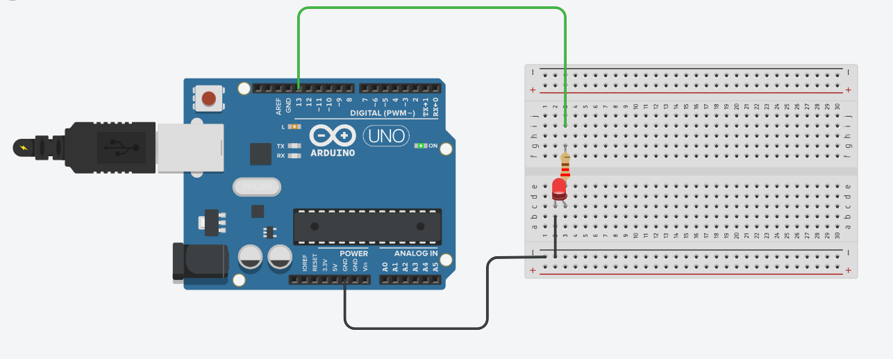

# 💡 Arduino - Pisca LED Externo (Parte 2)

Nesta segunda parte, o projeto mostra como **fazer um LED externo piscar** utilizando um circuito simples montado em uma **protoboard (clipboard)** e controlado pelo **Arduino**.

---


---

## 🧠 Objetivo

Demonstrar o controle de um **LED externo** com o Arduino, utilizando o pino digital 13 e um pequeno circuito com resistor para limitar a corrente.

---

## ⚙️ Materiais Utilizados

| Componente | Quantidade | Função |
|-------------|-------------|--------|
| Arduino Uno (ou compatível) | 1 | Microcontrolador principal |
| Protoboard | 1 | Montagem do circuito |
| LED verde | 1 | Indicador visual |
| Resistor de 220Ω | 1 | Limita a corrente do LED |
| Jumpers (fios de conexão) | 3 | Conexão entre Arduino e protoboard |


---

## 🧠 Código em C++

```cpp
void setup()
{
  pinMode(13, OUTPUT);
}

void loop()
{
  digitalWrite(13, HIGH);
  delay(1000); // Espera 1 segundo com o LED ligado
  digitalWrite(13, LOW);
  delay(1000); // Espera 1 segundo com o LED desligado
}
```

---
## Visualização Tinkercad


---

## Link para vídeo 
link vídeo -> https://drive.google.com/drive/folders/1cAWTjd201kbJpLSflov7lV-CwhMsODYw?usp=sharing

---

## Link Tinkercad

link Tinkercad -> https://www.tinkercad.com/things/5av2laiNE47/editel?returnTo=%2Fdashboard%2Fdesigns%2Fcircuits&sharecode=N823Vgs0gHriQT5imFvk3i93Qgk8FB5pppp4X3JyLM0
